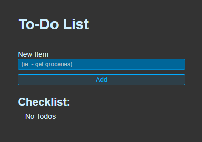
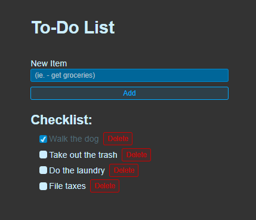

# To-Do List

This is a basic to-do list created using React JS and Vite! In this list, you can add new tasks, check them off to mark them as completed or not, and delete items in your list that you no longer need. The tasks are stored in the browser's local storage, so refreshes of the page will not reset the list.

Attached below are a few screenshots showcasing the application:

This repository can be cloned and hosted locally, since this is not officially hosted anywhere else at this time, but I hope you enjoy the application if you choose to clone and use it!

---

Rex A. Herndon
